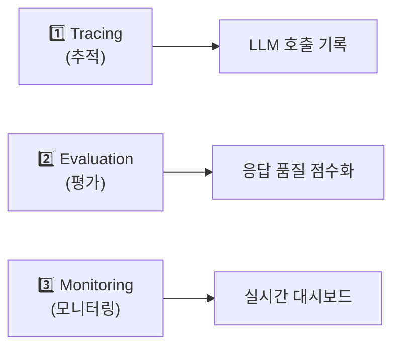

# Opik Evaluation Integration Plan for iUM

이 문서는 iUM 학습 플랫폼의 AI 튜터(RAG 기반 에이전트)에 **Opik 평가(Evaluation)** 기능을 통합하기 위한 계획입니다.

---

## 🔰 Opik이란? (초보자용 설명)

**Opik**은 LLM(대규모 언어 모델) 애플리케이션을 **추적(Tracing)**, **평가(Evaluation)**, **모니터링(Monitoring)**하기 위한 오픈소스 프레임워크입니다.

### Opik의 세 가지 핵심 기능



| 기능 | 설명 | iUM에서의 활용 |
|------|------|---------------|
| **Tracing** | LLM 호출의 입력/출력을 자동으로 기록 | 튜터 대화 내역 저장 |
| **Evaluation** | 응답의 품질을 자동으로 점수화 | 답변의 정확성, 관련성 측정 |
| **Monitoring** | 프로덕션 환경에서 실시간 모니터링 | 성능 저하 감지 |

---

## 📊 현재 상태 분석

### 현재 구현된 것 ✅
- [opik_config.py](file:///c:/sihyun/kaist/encode_hackathon/iUM/apps/api/utils/opik_config.py): 기본 `@trace` 데코레이터 (placeholder)
- `requirements.txt`에 `opik>=0.1.0` 포함
- RAG 체인 함수들에 `@trace` 데코레이터 적용 중

### 현재 부족한 점 ❌
- `@trace` 데코레이터가 실제로 Opik에 데이터를 전송하지 않음 (stub 구현)
- **Evaluation 메트릭** 미적용 (응답 품질 측정 불가)
- **Dataset** 관리 기능 없음 (테스트셋 관리 불가)
- **Experiment** 기능 없음 (A/B 테스트 등 비교 실험 불가)

---

## Proposed Changes

### Phase 1: Proper Tracing Setup (기본 추적 설정)

#### [MODIFY] [opik_config.py](file:///c:/sihyun/kaist/encode_hackathon/iUM/apps/api/utils/opik_config.py)

Opik의 공식 `@track` 데코레이터와 `OpikTracer` (LangChain 콜백)를 사용하도록 수정:

```python
# Before (현재 - placeholder)
def trace(func):
    return func  # 아무것도 안 함

# After (제안 - 실제 Opik 연동)
import opik
from opik.integrations.langchain import OpikTracer

opik.configure(api_key=OPIK_API_KEY)
tracer = OpikTracer()

@opik.track
def my_function():
    # 자동으로 Opik에 기록됨
    pass
```

---

### Phase 2: LangChain Integration with OpikTracer

#### [MODIFY] [rag_chain.py](file:///c:/sihyun/kaist/encode_hackathon/iUM/apps/api/utils/rag_chain.py)

LangChain 체인 실행 시 `OpikTracer`를 콜백으로 전달:

```diff
+ from opik.integrations.langchain import OpikTracer

  def create_rag_chain(...):
+     tracer = OpikTracer(tags=["ium-tutor", "rag"])
      chain = (
          {"context": retriever, "question": RunnablePassthrough()}
          | prompt_template
          | llm
          | StrOutputParser()
      )
-     return chain
+     return chain, tracer  # tracer를 함께 반환

  async def query_rag_chain(...):
+     chain, tracer = create_rag_chain(...)
-     raw_answer = chain.invoke(question)
+     raw_answer = chain.invoke(question, config={"callbacks": [tracer]})
```

---

### Phase 3: Evaluation Metrics (평가 메트릭 추가)

#### [NEW] [opik_evaluation.py](file:///c:/sihyun/kaist/encode_hackathon/iUM/apps/api/utils/opik_evaluation.py)

RAG 시스템에 적합한 평가 메트릭을 정의:

```python
from opik.evaluation.metrics import (
    AnswerRelevance,   # 답변이 질문에 관련 있는가?
    ContextRecall,     # 필요한 정보가 모두 검색되었는가?
    ContextPrecision,  # 검색된 정보가 모두 관련 있는가?
    Hallucination,     # 환각(거짓 정보) 포함 여부
)

# iUM 에 적합한 평가 메트릭 조합
IUM_METRICS = [
    AnswerRelevance(),      # 답변 관련성 (0-1)
    ContextRecall(),        # 문맥 재현율 (0-1)
    ContextPrecision(),     # 문맥 정밀도 (0-1)
    Hallucination(),        # 환각 탐지 (True/False)
]
```

**사용 예시:**
```python
from opik.evaluation import evaluate

# 테스트 데이터셋에 대해 평가 실행
results = evaluate(
    experiment_name="ium-tutor-v1",
    dataset=test_dataset,
    task=query_rag_chain,  # 평가할 함수
    scoring_metrics=IUM_METRICS
)
```

---

### Phase 4: Dataset Management (테스트 데이터셋 관리)

#### [NEW] [evaluation_dataset.py](file:///c:/sihyun/kaist/encode_hackathon/iUM/apps/api/utils/evaluation_dataset.py)

골든 테스트셋(정답이 있는 Q&A 쌍)을 관리:

```python
from opik import Opik

client = Opik()

# 데이터셋 생성
dataset = client.get_or_create_dataset("ium-tutor-golden-set")

# 테스트 케이스 추가
dataset.insert([
    {
        "input": {"question": "광합성의 과정을 설명해줘"},
        "expected_output": "광합성은 식물이 빛에너지를...",
        "context": "광합성 관련 문서 텍스트..."
    },
    {
        "input": {"question": "맥스웰 방정식이 뭐야?"},
        "expected_output": "맥스웰 방정식은 전자기학의 기본 법칙으로...",
        "context": None  # 문서 없이 일반 지식으로 답해야 하는 케이스
    }
])
```

---

### Phase 5: Evaluation API Endpoint

#### [NEW] [routers/evaluation.py](file:///c:/sihyun/kaist/encode_hackathon/iUM/apps/api/routers/evaluation.py)

평가를 트리거하고 결과를 확인하는 엔드포인트:

```python
from fastapi import APIRouter
from utils.opik_evaluation import run_evaluation

router = APIRouter(prefix="/api/evaluation", tags=["Evaluation"])

@router.post("/run")
async def run_evaluation_endpoint(dataset_name: str = "ium-tutor-golden-set"):
    """테스트 데이터셋에 대해 평가 실행"""
    results = await run_evaluation(dataset_name)
    return {
        "experiment_id": results.experiment_id,
        "metrics": results.aggregate_metrics()
    }

@router.get("/results/{experiment_id}")
async def get_evaluation_results(experiment_id: str):
    """평가 결과 조회"""
    # Opik 대시보드 링크 또는 상세 결과 반환
    ...
```

---

## 파일 변경 요약

| 파일 | 작업 유형 | 설명 |
|------|---------|------|
| `utils/opik_config.py` | MODIFY | Opik 공식 API로 재구현 |
| `utils/rag_chain.py` | MODIFY | OpikTracer 콜백 추가 |
| `utils/opik_evaluation.py` | NEW | 평가 메트릭 정의 |
| `utils/evaluation_dataset.py` | NEW | 테스트셋 관리 |
| `routers/evaluation.py` | NEW | 평가 API 엔드포인트 |
| `main.py` | MODIFY | evaluation 라우터 등록 |

---

## Verification Plan

### Automated Tests
```bash
# 1. 환경변수 설정 확인
echo $OPIK_API_KEY

# 2. 단일 질문에 대한 추적 테스트
curl -X POST "http://localhost:8000/api/agent/chat" \
  -H "Content-Type: application/json" \
  -d '{"message": "광합성이 뭐야?"}'

# 3. Opik 대시보드에서 trace 확인
# https://app.comet.com/opik 에서 로그 확인

# 4. 평가 실행 테스트
curl -X POST "http://localhost:8000/api/evaluation/run"
```

### Manual Verification
1. [Comet Opik Dashboard](https://app.comet.com/opik)에서 Traces 탭 확인
2. 각 LLM 호출의 입력/출력이 기록되는지 확인
3. Evaluation 탭에서 메트릭 점수 확인

---

## 🎯 기대 효과

1. **품질 측정**: 튜터 응답의 정확성/관련성을 수치화
2. **회귀 방지**: 프롬프트 변경 시 성능 저하 감지
3. **A/B 테스트**: 다른 모델/프롬프트 비교 가능
4. **디버깅**: 문제 발생 시 trace로 원인 추적

---

## User Review Required

> [!IMPORTANT]
> **Opik API Key 필요**: 이 기능을 사용하려면 [Comet.com](https://www.comet.com)에서 계정을 만들고 API Key를 발급받아야 합니다. 환경변수 `OPIK_API_KEY`에 설정해주세요.

> [!NOTE]
> **Phase 순서**: Phase 1-2 (Tracing)는 빠르게 구현 가능하며, Phase 3-5 (Evaluation)는 테스트 데이터셋 준비가 필요합니다. 어느 Phase까지 구현할지 결정해주세요.
