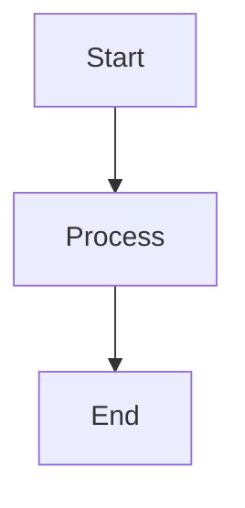

# iUM Project Context

## Project Overview

**iUM (Insight, Understanding, Mastery)** is an AI-powered personalized learning platform that transforms uploaded documents into interactive learning experiences. The system analyzes user documents and automatically generates conversational tutoring, quizzes, diagrams, and short-form videos (Reels), organizing all learning content in a notebook-style interface inspired by Jupyter notebooks.

### Core Value Proposition

- **Document-to-Knowledge Pipeline**: Upload PDFs, text files, or other documents → RAG-based vectorization → AI-powered learning content generation
- **Notebook-Style Learning**: Multi-cell notebooks (.ium format) where each cell represents a learning unit (concept, quiz, diagram, code, math)
- **Agentic Learning Ecosystem**: Real-time AI tutoring with status streaming, automated content generation, and progress tracking

---

## Tech Stack

### Frontend (`apps/web`)

- **Framework**: Next.js 15.5 (App Router)
- **Language**: TypeScript
- **UI Library**: React 18, Tailwind CSS, shadcn/ui
- **State Management**: Zustand (with persist middleware)
- **Authentication**: Supabase Auth (Google OAuth)
- **Database Client**: Supabase JS Client
- **Rendering**:
  - ReactMarkdown (with remark-math, remark-gfm)
  - Mermaid.js (diagrams)
  - KaTeX (mathematical equations)
  - rehype-katex
- **Theme**: next-themes (Light/Dark/System)

### Backend (`apps/api`)

- **Framework**: FastAPI (Python 3.11+)
- **LLM**: Google Gemini 2.5 Flash (via langchain-google-genai)
- **RAG Framework**: LangChain
- **Vector Store**: ChromaDB (for document embeddings)
- **Observability**: Opik by Comet ML
- **Storage**: Supabase Storage (document persistence)
- **Database**: Supabase PostgreSQL (metadata)
- **Streaming**: Server-Sent Events (SSE) for real-time status updates

### Infrastructure

- **Frontend Hosting**: Vercel
- **Backend Hosting**: Render
- **Database**: Supabase PostgreSQL
- **File Storage**: Supabase Storage (bucket: `documents`)

---

## Architecture Overview

### System Flow

```
User Upload Document
    ↓
[Supabase Storage] (Persistence) + [Supabase DB] (Metadata)
    ↓
[ChromaDB Vector Store] (RAG Retrieval)
    ↓
User Query → [RAG Chain with Google Gemini] → Structured Learning Unit
    ↓
[Zustand Store] → Notebook Tab (.ium format)
    ↓
Auto-Sync to Supabase Storage (500ms debounce)
```

### Key Data Models

#### NotebookTab (Multi-Cell Container)

```typescript
interface NotebookTab {
  id: string;
  title: string;
  cells: Cell[];
  createdAt: number;
  updatedAt: number;
  syncInfo?: TabSyncInfo; // Links to Supabase file
}
```

#### Cell (Learning Unit)

```typescript
interface Cell {
  id: string;
  type: "concept" | "math" | "code" | "summary" | "quiz";
  title: string;
  content: string; // Markdown with Mermaid diagrams
  equations?: string[]; // LaTeX strings
  quiz_data?: QuizQuestion[];
  isBookmarked: boolean;
  createdAt: number;
  updatedAt?: number;
}
```

#### .ium File Format (Like .ipynb for iUM)

```typescript
interface IumFile {
  version: string; // "1.0"
  metadata: {
    title: string;
    createdAt: number;
    updatedAt: number;
    author?: string;
  };
  cells: Cell[];
}
```

---

## Current Features

### ✅ Completed Features

- **Authentication**: Google OAuth via Supabase Auth
- **Folder System**: Create, rename, delete folders with custom colors
- **File Management**:
  - Upload files (PDF, text, .ium notebooks) to Supabase Storage
  - UUID-based filenames to avoid encoding issues
  - File rename, delete (with cloud deletion)
  - Bulk file selection and deletion
  - Dynamic file type icons
- **RAG-Powered Chat**:
  - Document ingestion with vector embeddings (ChromaDB)
  - Real-time streaming status updates ("Searching...", "Analyzing...", "Generating...")
  - Source citation with relevance scores
  - Folder-scoped context filtering
- **Notebook System**:
  - Multi-cell notebook tabs (inspired by Jupyter)
  - Cell types: concept, math, code, quiz, summary
  - Cell actions: bookmark, delete, move to new tab
  - Auto-generation from chat responses (LLM outputs structured JSON)
  - Mermaid diagram rendering
  - LaTeX math equation support
- **Auto-Sync**:
  - 500ms debounced auto-save to Supabase Storage
  - .ium file format for persistence
  - Sync indicators and conflict resolution
- **Bookmarks**: Sidebar navigation for bookmarked cells across all tabs
- **Learning Timeline**: Auto-generated study session summaries
- **Theme System**: Light/Dark/System with next-themes
- **Feedback System**: Like/dislike buttons for AI responses
- **Opik Integration**: Observability and tracing for RAG pipeline
- **Reels Tab Enhancements**:
  - Vertical scroll with smooth animations
  - Wheel scroll support for desktop navigation
  - Delete functionality with Supabase synchronization
  - Improved popover UI for reel actions
- **File System Synchronization**:
  - Notebook-to-file bidirectional sync
  - Auto-save with conflict resolution
  - Real-time sync indicators
  - Database dependency management (user → folder → file cascade)

### 🚧 In Progress

- **Quick Tools Panel**: Rapid access to common actions
- **Content Format Expansion**: Enhanced quiz types, flashcards, interactive diagrams
- **PDF Viewer Integration**: In-app PDF reading with scrollable containers

### 📋 Planned Features

- **Highlights Tab**: Key concept extraction and highlighting
- **Onboarding Flow**: First-time user experience
- **Deep Research Mode**: Multi-step research workflows
- **Quiz Enhancements**: Time limits, "I don't know" option
- **Advanced PDF Features**: Annotations, highlighting, note-taking

---

## Code Conventions

### Frontend Code Style

- **Variables/Functions**: camelCase
- **Components**: Functional components (React FC), PascalCase filenames
- **Styling**: Tailwind CSS with inline classes
- **File Naming**: kebab-case for utilities, PascalCase.tsx for components
- **State Management**: Zustand store (`apps/web/lib/store.ts`)
- **Type Safety**: Strict TypeScript, explicit interface definitions

### Backend Code Style

- **Functions**: snake_case
- **Classes**: PascalCase
- **Type Hints**: Required for all function signatures
- **Async**: Use `async/await` for I/O operations
- **Error Handling**: Raise `HTTPException` with status codes

### Project Structure

```
apps/
├── web/                          # Next.js Frontend
│   ├── app/                      # App Router pages & layouts
│   │   ├── (auth)/              # Auth routes (login)
│   │   ├── settings/            # Settings page
│   │   └── globals.css          # Global styles & theme variables
│   ├── components/
│   │   ├── ui/                  # shadcn/ui components
│   │   ├── views/
│   │   │   └── HardView/        # Main workspace view
│   │   │       ├── MainContentArea.tsx    # Notebook tab renderer
│   │   │       ├── ChatSidebar.tsx        # AI chat interface
│   │   │       ├── FolderSidebar.tsx      # File manager
│   │   │       ├── CellRenderer.tsx       # Individual cell display
│   │   │       ├── CellToolbar.tsx        # Cell actions
│   │   │       └── BookmarksSection.tsx   # Bookmarks sidebar
│   │   ├── QuizView.tsx         # Quiz renderer
│   │   └── Mermaid.tsx          # Diagram renderer
│   ├── lib/
│   │   ├── store.ts             # Zustand global state
│   │   ├── api.ts               # Backend API client
│   │   ├── supabase/            # Supabase client setup
│   │   └── utils.ts             # Helper utilities
│   ├── hooks/                   # Custom React hooks
│   └── types/                   # TypeScript type definitions
└── api/                          # FastAPI Backend
    ├── main.py                   # FastAPI app entry point
    ├── routers/
    │   ├── agent.py              # Chat & AI endpoints (SSE streaming)
    │   ├── ingest.py             # Document upload & processing
    │   └── workspace.py          # Folder/file management
    ├── utils/
    │   ├── rag_chain.py          # RAG pipeline with Gemini
    │   ├── vector_store.py       # ChromaDB operations
    │   ├── supabase_client.py    # Supabase Python client
    │   └── opik_config.py        # Opik observability setup
    ├── models.py                 # Pydantic models
    └── prompts/                  # LLM prompt templates (if needed)
```

### API Endpoints

#### Authentication

All authenticated endpoints require:

```
Authorization: Bearer {supabase_jwt_token}
```

#### Chat & Agent

- `POST /api/agent/message` - Send chat message (SSE streaming)
- `GET /api/agent/chat/{conversation_id}/history` - Get chat history
- `POST /api/agent/chat/summary` - Generate study summary

#### File Management

- `POST /api/ingest/upload` - Upload document (PDF, text, .ium)
- `GET /api/ingest/status` - Get ingestion status
- `GET /api/workspace/{workspace_id}/folders` - List folders & files
- `PUT /api/workspace/{workspace_id}/files/{file_id}` - Rename file
- `DELETE /api/workspace/{workspace_id}/files/{file_id}` - Delete file
- `GET /api/workspace/file/{file_id}/content` - Get file content (.ium)

### Database Schema (Supabase PostgreSQL)

#### `users` table

Managed by Supabase Auth, extended via `user_metadata`:

- `id` (uuid, PK)
- `email`
- `user_metadata` (jsonb): `{ display_name, avatar_url }`

#### `folders` table

```sql
- id (uuid, PK)
- user_id (uuid, FK → auth.users)
- name (text)
- color (text, default: '#3B82F6')
- created_at (timestamptz)
```

#### `files` table

```sql
- id (uuid, PK)
- user_id (uuid, FK → auth.users)
- folder_id (uuid, FK → folders, nullable)
- name (text)                    -- Original filename
- storage_path (text)            -- UUID-based path in Storage
- created_at (timestamptz)
- updated_at (timestamptz)
```

#### Supabase Storage

- **Bucket**: `documents`
- **Path Structure**: `{folder_id}/{uuid}.{ext}`
- **Access**: Row Level Security (RLS) enforced

---

## Critical Implementation Patterns ⚠️

> **IMPORTANT**: These patterns were discovered through debugging and MUST be followed to avoid runtime errors.

### 1. Supabase Storage: Non-ASCII Filename Handling

**Problem**: Korean (or any non-ASCII) filenames cause `InvalidKey` error in Supabase Storage.

**Solution**: Use UUID-based filenames in Storage, store original name in DB.

**Location**: [apps/api/routers/ingest.py](apps/api/routers/ingest.py)

```python
# ❌ WRONG: Direct filename (fails with non-ASCII)
storage_path = f"{folder_id}/{file.filename}"

# ✅ CORRECT: UUID-based filename
import uuid
file_ext = os.path.splitext(file.filename)[1].lower()
safe_filename = f"{uuid.uuid4().hex}{file_ext}"
storage_path = f"{folder_id}/{safe_filename}"

# Store original filename in DB 'name' field
db_record = {
  "name": file.filename,  # Original name for display
  "storage_path": storage_path  # UUID path for Storage
}
```

### 2. Supabase Query: Avoid `.single()` for Nullable Results

**Problem**: `.single()` throws `PGRST116` error when query returns 0 rows.

**Solution**: Use `.execute()` and manually check result length.

**Location**: [apps/api/routers/workspace.py](apps/api/routers/workspace.py)

```python
# ❌ WRONG: Throws exception on empty result
file_response = supabase.table("files").select("*").eq("id", file_id).single().execute()

# ✅ CORRECT: Safe nullable query
file_response = supabase.table("files").select("*").eq("id", file_id).execute()
if not file_response.data or len(file_response.data) == 0:
    raise HTTPException(status_code=404, detail="File not found")
file_data = file_response.data[0]
```

### 3. Authentication: Always Pass JWT Token

**Problem**: API calls without `Authorization` header result in `user_id = null` due to RLS.

**Solution**: Always extract session token and include in API headers.

**Location**: [apps/web/lib/store.ts](apps/web/lib/store.ts) (saveTabToSupabase, syncTabToSupabase)

```typescript
// Get session from Supabase client
const {
  data: { session },
} = await supabase.auth.getSession();

// Include Authorization header in all API calls
const headers: HeadersInit = {};
if (session?.access_token) {
  headers["Authorization"] = `Bearer ${session.access_token}`;
}

fetch(`${apiUrl}/api/endpoint`, {
  method: "POST",
  headers,
  body: formData,
});
```

### 4. Next.js Theme: Prevent Hydration Mismatch

**Problem**: Theme buttons don't work, or hydration errors occur with `useTheme()`.

**Solution**: Use `mounted` state to ensure client-side rendering for theme UI.

**Location**: [apps/web/app/settings/page.tsx](apps/web/app/settings/page.tsx)

```typescript
import { useTheme } from "next-themes";
import { useState, useEffect } from "react";

const { theme, setTheme } = useTheme();
const [mounted, setMounted] = useState(false);

// Prevent hydration mismatch
useEffect(() => {
  setMounted(true);
}, []);

// Only render theme buttons after mount
{mounted && (
  <Button onClick={() => setTheme("dark")}>Dark</Button>
)}
```

**Also ensure** ThemeProvider is configured in [apps/web/app/layout.tsx](apps/web/app/layout.tsx):

```typescript
<ThemeProvider
  attribute="class"
  defaultTheme="system"
  enableSystem
  storageKey="ium-theme"
>
  {children}
</ThemeProvider>
```

### 5. Notebook Tabs: Prevent Duplicate Tab Opening

**Problem**: Clicking an already-open .ium file creates duplicate tabs.

**Solution**: Check `syncInfo.fileId` before creating new tab.

**Location**: [apps/web/lib/store.ts](apps/web/lib/store.ts) (`loadTabFromIum`)

```typescript
loadTabFromIum: (iumData, folderId, fileId) => {
  const state = get();

  // Check if file is already open
  if (fileId) {
    const existingTab = state.notebookTabs.find(
      (tab) => tab.syncInfo?.fileId === fileId,
    );
    if (existingTab) {
      // Already open - just focus it
      set({ notebookActiveTabId: existingTab.id });
      return existingTab.id;
    }
  }

  // Not open - create new tab
  // ... create tab logic
};
```

### 6. Deprecated: `notebooks` Table (Unused)

**Background**: Initially planned to use PostgreSQL for notebook storage, later pivoted to Supabase Storage (.ium files).

**Status**: The `notebooks` table exists in migrations but is **NOT USED**. Safe to delete if cleaning up schema.

**Location**: `apps/web/supabase/migrations/001_create_notebooks_table.sql`

---

## Key Implementation Details

### RAG Pipeline with Streaming

**Location**: [apps/api/utils/rag_chain.py](apps/api/utils/rag_chain.py)

The RAG chain uses async generators to stream status updates to the frontend:

```python
async def query_rag_chain(question: str, collection_name: str, ...):
    # 1. Send "Searching" status
    yield {"status": "progress", "step": "searching", "message": "Searching knowledge base... 🔍"}

    # 2. Retrieve documents from ChromaDB
    retriever = get_retriever(collection_name, k=4, folder_id=folder_id)
    relevant_docs = retriever.invoke(question)

    # 3. Send "Analyzing" status
    yield {"status": "progress", "step": "analyzing", "message": f"Found {len(relevant_docs)} documents. Analyzing... 🧠"}

    # 4. Send "Generating" status
    yield {"status": "progress", "step": "generating", "message": "Formulating response... ✍️"}

    # 5. Call Gemini LLM
    llm = ChatGoogleGenerativeAI(model="models/gemini-2.5-flash", temperature=0)
    response = await llm.ainvoke(prompt)

    # 6. Parse Learning Unit JSON from <LEARNING_UNIT> tags
    answer, learning_unit_dict = parse_learning_unit_from_response(response.content)

    # 7. Send final result
    yield {"status": "complete", "data": {"message": answer, "learning_unit": learning_unit_dict, ...}}
```

**Frontend API Client** ([apps/web/lib/api.ts](apps/web/lib/api.ts)):

```typescript
async sendMessage(message: string, options, onStatusUpdate?: (status: string) => void) {
  const response = await fetch(`${API_BASE_URL}/api/agent/message`, { method: "POST", body: JSON.stringify({...}) });

  const reader = response.body?.getReader();
  const decoder = new TextDecoder();

  while (true) {
    const { done, value } = await reader.read();
    if (done) break;

    const chunk = decoder.decode(value);
    const lines = chunk.split("\n\n");

    for (const line of lines) {
      if (line.startsWith("data: ")) {
        const data = JSON.parse(line.replace("data: ", ""));

        if (data.status === "progress") {
          onStatusUpdate?.(data.message); // Update UI with "Searching...", etc.
        } else if (data.status === "complete") {
          return data.data; // Return final ChatResponse
        }
      }
    }
  }
}
```

### Auto-Sync System

**Location**: [apps/web/lib/store.ts](apps/web/lib/store.ts)

Notebook tabs automatically sync to Supabase Storage with debouncing:

```typescript
// Queue a sync with 500ms debounce
queueTabSync: (tabId, immediate = false) => {
  const state = get();
  const tab = state.notebookTabs.find((t) => t.id === tabId);

  // Only sync tabs that have been saved before (have syncInfo)
  if (!tab?.syncInfo) return;

  // Clear existing timer
  const existingTimer = state._syncDebounceTimers.get(tabId);
  if (existingTimer) clearTimeout(existingTimer);

  if (immediate) {
    get().syncTabToSupabase(tabId);
  } else {
    const timer = setTimeout(() => {
      get().syncTabToSupabase(tabId);
      get()._syncDebounceTimers.delete(tabId);
    }, 500);

    state._syncDebounceTimers.set(tabId, timer);
  }
};

// Sync is triggered on:
// - appendCellToActiveTab (new cell added from chat)
// - deleteCell
// - updateCell
// - toggleBookmark
// - renameNotebookTab (immediate sync)
```

### LLM Prompt Structure

**Location**: [apps/api/utils/rag_chain.py](apps/api/utils/rag_chain.py)

The Feynman Tutor prompt instructs Gemini to generate structured learning units:

````
You are an expert AI tutor named iUM...

**Learning Unit Generation (CRITICAL):**
You MUST generate a structured Learning Unit JSON wrapped in <LEARNING_UNIT> tags.

MODE A: GENERAL EXPLANATION (Default)
- "type": "concept" | "math" | "code" | "summary"
- "content": Markdown with Mermaid diagrams
- MERMAID RULES: Use graph TD/LR, double quotes for labels, NO "note for", NO "linkStyle"

MODE B: QUIZ REQUEST
- "type": "quiz"
- "quiz_data": Array of questions with options and explanations

<LEARNING_UNIT>
{
  "title": "Topic",
  "type": "concept",
  "content": "Explanation with ```mermaid\ngraph TD\nA[\"Start\"] --> B[\"End\"]\n```",
  "equations": ["E=mc^2"],
  "quiz_data": []
}
</LEARNING_UNIT>
````

**Frontend Parsing** ([apps/web/components/views/HardView/ChatSidebar.tsx](apps/web/components/views/HardView/ChatSidebar.tsx)):

```typescript
const response = await api.chat.sendMessage(input, {...}, onStatusUpdate);

if (response.learning_unit) {
  appendCellToActiveTab(response.learning_unit); // Adds cell to active notebook tab
}
```

---

## Development Roadmap

### Phase 1: Core Feature Completion (Current)

| Priority  | Task                                           | Owner    | Status               |
| --------- | ---------------------------------------------- | -------- | -------------------- |
| 🔴 High   | Generated Contents → Notebook Cells            | Daehan   | ✅ Implemented       |
| 🔴 High   | Content Format Implementation (Quiz, Diagrams) | Daehan   | ✅ Done              |
| 🔴 High   | File System Synchronization                    | Daehan   | ✅ Completed (Feb 2) |
| 🟡 Medium | Reels Tab Enhancements (Scroll, Delete, UI)    | Donghyuk | ✅ Completed (Feb 7) |
| 🟡 Medium | Quick Tools Panel + File Drag                  | Daehan   | 📋 To Do             |

### Phase 2: UX Improvements

| Priority  | Task                   | Owner  | Status         |
| --------- | ---------------------- | ------ | -------------- |
| 🔴 High   | PDF Viewer Integration | Daehan | 🚧 In Progress |
| 🟡 Medium | Onboarding Flow        | Daehan | 📋 To Do       |
| 🟡 Medium | Highlights Tab         | Minjun | 📋 To Do       |
| � Medium  | Advanced Quiz Features | Team   | 📋 To Do       |

### Phase 3: Advanced Features

| Priority  | Task                          | Owner  | Status   |
| --------- | ----------------------------- | ------ | -------- |
| 🟡 Medium | YouTube Integration for Reels | Sihyun | 📋 To Do |
| 🟢 Low    | Deep Research / Overlay Mode  | Daehan | 📋 To Do |
| 🟢 Low    | Advanced PDF Annotations      | Daehan | 📋 To Do |

---

## Quick Reference

### Local Development Setup

**Prerequisites**:

- Node.js 18+ (for frontend)
- Python 3.11+ (for backend)
- pnpm (for frontend package management)

**Frontend** ([apps/web](apps/web)):

```bash
cd apps/web
pnpm install
pnpm dev  # Runs on http://localhost:3000
```

**Backend** ([apps/api](apps/api)):

```bash
cd apps/api
python -m venv venv
source venv/bin/activate  # On Windows: venv\Scripts\activate
pip install -r requirements.txt
./run.sh  # Runs on http://localhost:8000
```

### Environment Variables

**Frontend** (`.env.local` in `apps/web`):

```env
NEXT_PUBLIC_API_URL=http://localhost:8000
NEXT_PUBLIC_SUPABASE_URL=https://your-project.supabase.co
NEXT_PUBLIC_SUPABASE_ANON_KEY=your-anon-key
```

**Backend** (`.env` in `apps/api`):

```env
GOOGLE_API_KEY=your-google-api-key  # For Gemini LLM
SUPABASE_URL=https://your-project.supabase.co
SUPABASE_KEY=your-service-role-key  # Not anon key!
OPIK_API_KEY=your-opik-api-key  # Optional (for observability)
LLM_MODEL=models/gemini-2.5-flash  # Optional (default)
```

### Common Commands

**Frontend**:

```bash
pnpm build          # Production build
pnpm lint           # Run ESLint
pnpm type-check     # TypeScript type checking
```

**Backend**:

```bash
uvicorn main:app --reload  # Run with auto-reload
pytest                      # Run tests (if configured)
python check_models.py      # Verify Gemini API connection
```

### Useful File Paths

**Critical State Management**:

- [apps/web/lib/store.ts](apps/web/lib/store.ts) - Zustand global state (notebook tabs, folders, chat)

**Main UI Components**:

- [apps/web/components/views/HardView/MainContentArea.tsx](apps/web/components/views/HardView/MainContentArea.tsx) - Notebook tab renderer
- [apps/web/components/views/HardView/ChatSidebar.tsx](apps/web/components/views/HardView/ChatSidebar.tsx) - AI chat interface
- [apps/web/components/views/HardView/CellRenderer.tsx](apps/web/components/views/HardView/CellRenderer.tsx) - Individual cell display

**Backend Core Logic**:

- [apps/api/routers/agent.py](apps/api/routers/agent.py) - Chat endpoint with SSE streaming
- [apps/api/utils/rag_chain.py](apps/api/utils/rag_chain.py) - RAG pipeline implementation
- [apps/api/routers/ingest.py](apps/api/routers/ingest.py) - Document upload & vectorization

### Team

- **Donghyuk Lee (PM)**: Project Lead
- **Daehan Won**: Full-stack Development (Backend/Frontend)
- **Minjun Jee**: Frontend Development (Reels, UI/UX)
- **Sihyun Lim**: Backend Development (Opik, AI Pipeline)

---

## System Architecture Deep Dive

### End-to-End Flow: Document Upload to Learning

1. **User uploads document** (PDF, text file)
   - Frontend: [FolderSidebar.tsx](apps/web/components/views/HardView/FolderSidebar.tsx) `handleFileUpload()`
   - API call: `POST /api/ingest/upload` with FormData + auth token

2. **Backend processes upload** ([ingest.py](apps/api/routers/ingest.py))

   ```python
   # a) Save to Supabase Storage (UUID filename)
   storage_path = f"{folder_id}/{uuid.uuid4().hex}{file_ext}"
   supabase.storage.from_("documents").upload(storage_path, content)

   # b) Save metadata to PostgreSQL
   file_record = {
     "name": file.filename,
     "storage_path": storage_path,
     "folder_id": folder_id,
     "user_id": user_id
   }
   supabase.table("files").insert(file_record).execute()

   # c) Extract text and create embeddings
   documents = process_pdf_file(tmp_path) or process_text_file(tmp_path)
   add_documents_to_vector_store(documents, collection_name, metadata={
     "document_id": file_id,
     "folder_id": folder_id
   })
   ```

3. **User asks a question** in chat
   - Frontend: [ChatSidebar.tsx](apps/web/components/views/HardView/ChatSidebar.tsx) `handleSend()`
   - API call: `POST /api/agent/message` (SSE streaming)

4. **Backend RAG pipeline** ([rag_chain.py](apps/api/utils/rag_chain.py))

   ```python
   async def query_rag_chain(...):
     # Stream status updates
     yield {"status": "progress", "message": "Searching..."}

     # Retrieve relevant chunks from ChromaDB
     retriever = get_retriever(collection_name, folder_id=folder_id)
     docs = retriever.invoke(question)

     # Format prompt with Feynman Tutor template
     context = "\n\n".join([d.page_content for d in docs])
     prompt = FEYNMAN_TUTOR_PROMPT.format(context=context, question=question)

     # Call Gemini LLM
     llm = ChatGoogleGenerativeAI(model="gemini-2.5-flash")
     response = await llm.ainvoke(prompt)

     # Parse <LEARNING_UNIT> JSON
     answer, learning_unit = parse_learning_unit_from_response(response.content)

     # Return final result
     yield {"status": "complete", "data": {
       "message": answer,
       "learning_unit": learning_unit,
       "sources": [...],
       "reasoning_chain": [...]
     }}
   ```

5. **Frontend receives response**
   - Parse SSE stream in [api.ts](apps/web/lib/api.ts) `sendMessage()`
   - Update loading status UI in real-time
   - Extract `learning_unit` from final response

6. **Add to notebook** ([store.ts](apps/web/lib/store.ts))

   ```typescript
   if (response.learning_unit) {
     appendCellToActiveTab(response.learning_unit);
     // Creates new Cell, adds to active NotebookTab
     // Triggers auto-sync after 500ms debounce
   }
   ```

7. **Auto-sync to cloud** ([store.ts](apps/web/lib/store.ts))
   ```typescript
   queueTabSync(tabId);
   // After 500ms, calls syncTabToSupabase()
   // Exports tab as .ium JSON
   // Uploads to Supabase Storage (upsert mode)
   // Updates syncInfo with lastSyncedAt timestamp
   ```

### Data Persistence Strategy

**Why .ium files instead of PostgreSQL?**

- **Portability**: Users can download/share notebooks as JSON files
- **Version Control**: .ium files can be git-tracked
- **Simplicity**: No complex DB schema for nested cells
- **Jupyter-like UX**: Familiar notebook paradigm

**Storage Hierarchy**:

```
Supabase Storage (documents bucket)
├── {folder_id}/
│   ├── {uuid1}.pdf          # User uploaded PDF
│   ├── {uuid2}.txt          # User uploaded text
│   └── {uuid3}.ium          # Notebook file (JSON)
```

**PostgreSQL Usage**:

- `folders`: Folder metadata (name, color, user_id)
- `files`: File metadata (name, storage_path, folder_id)
- **NOT USED**: `notebooks` table (deprecated)

### State Management Philosophy

**Zustand Store as Single Source of Truth**:

- All application state lives in [store.ts](apps/web/lib/store.ts)
- No prop drilling - components access state via `useAppStore()`
- Persist middleware for localStorage backup (non-sensitive data only)

**Key State Slices**:

```typescript
{
  // Notebook System
  notebookTabs: NotebookTab[],
  notebookActiveTabId: string | null,
  scrollToCellId: string | null,  // For bookmark navigation

  // Folder System
  knowledgeFolders: KnowledgeFolder[],
  activeFolderId: string | null,
  selectedDocumentIds: string[],  // For multi-select

  // UI State
  viewMode: "hard" | "soft",
  isMindMapOpen: boolean,
  activeSources: Source[],
  activeDocument: ActiveDocument | null,

  // History & Streaks
  timelineEvents: TimelineEvent[],
  userStreak: UserStreak,

  // Auto-Sync (internal)
  _pendingSyncs: Set<string>,
  _syncDebounceTimers: Map<string, NodeJS.Timeout>
}
```

### Security & Access Control

**Row Level Security (RLS)**:

- All Supabase tables have RLS policies
- Users can only see/modify their own data
- `user_id` extracted from JWT token

**Authentication Flow**:

```
User clicks "Sign in with Google"
  ↓
Supabase Auth redirects to Google OAuth
  ↓
Google returns to callback URL with auth code
  ↓
Supabase exchanges code for JWT token
  ↓
Frontend stores JWT in Supabase client
  ↓
All API calls include: Authorization: Bearer {jwt}
  ↓
Backend extracts user_id from JWT via supabase.auth.get_user(token)
```

**Storage Access**:

- Public bucket with RLS policies
- Files only accessible to owner via JWT validation
- No direct public URLs (or signed URLs with expiration)

---

## Troubleshooting

### "Google API Key is missing" error

- Check `.env` in `apps/api` has `GOOGLE_API_KEY=...`
- Restart backend after adding env variable
- Verify API key at [Google AI Studio](https://makersuite.google.com/app/apikey)

### "Failed to fetch file" error when opening .ium notebook

- Check backend logs for Supabase query errors
- Ensure `.execute()` is used instead of `.single()` (see Known Issues #2)
- Verify `storage_path` in `files` table matches actual Storage path

### Theme not changing in Settings

- Verify `useTheme()` hook is imported
- Check `mounted` state is used to prevent hydration mismatch
- Ensure `ThemeProvider` is in root layout with `attribute="class"`

### Notebook cells not auto-syncing

- Check browser console for `syncTabToSupabase` errors
- Verify tab has `syncInfo` (only syncs tabs that were previously saved)
- Check Supabase Storage bucket permissions

### Chat not generating learning units

- Check backend logs for JSON parsing errors
- Verify `<LEARNING_UNIT>` tags in LLM response
- Ensure Mermaid syntax is valid (no `note for`, no `linkStyle`)

---

## Next Steps for New Contributors

1. **Read this document** thoroughly
2. **Set up local environment** (see Quick Reference)
3. **Run both frontend and backend** and test basic flow:
   - Create a folder
   - Upload a PDF
   - Ask a question in chat
   - Verify cell appears in notebook
4. **Pick a task** from Development Roadmap
5. **Check "Critical Implementation Patterns"** before implementing
6. **Test thoroughly** with different file types and edge cases
7. **Submit PR** with clear description and screenshots

**Recommended First Tasks**:

- Add new cell type (e.g., "flashcard")
- Improve Mermaid diagram error handling
- Add keyboard shortcuts for notebook navigation
- Enhance quiz UI with animations

---

## Appendix: Key Technologies Explained

### Zustand

Lightweight React state management library. No boilerplate, no actions/reducers. Direct state mutation with `set()` and `get()`.

### Supabase

Open-source Firebase alternative. Provides PostgreSQL database, Storage (S3-like), and Auth (JWT-based) in one platform.

### ChromaDB

Vector database optimized for embeddings. Stores document chunks with vector representations for semantic search.

### LangChain

Framework for building LLM applications. Provides abstractions for:

- Document loaders (PDF, text)
- Text splitters (chunking)
- Vector stores (ChromaDB integration)
- Prompt templates
- Output parsers

### Google Gemini

Google's LLM API (via `langchain-google-genai`). Used because it's fast, cost-effective, and has good JSON output quality.

### Server-Sent Events (SSE)

HTTP-based protocol for server-to-client streaming. Simpler than WebSockets for one-way updates (status messages).

### Mermaid.js

Markdown-inspired diagram syntax rendered to SVG. Example:



### KaTeX

Fast math typesetting library for LaTeX equations. Renders `$E=mc^2$` as styled formulas.

---

## Version History

- **v1.0** (2025-01-20): Initial project setup
- **v1.1** (2025-02-06): Notebook system with .ium format, auto-sync, bookmarks
- **v1.2** (2026-02-02): File system synchronization, database dependency resolution
- **v1.3** (Current): Reels scroll animations, Supabase delete operations, improved file CRUD

**Last Updated**: 2026-02-07

---

## Recent Updates (Feb 2-7, 2026)

### Reels Feature Enhancements

- ✅ Implemented smooth scroll animations for vertical reel navigation
- ✅ Added wheel scroll support for desktop users
- ✅ Integrated delete functionality with Supabase backend synchronization
- ✅ Enhanced popover UI for better user interaction
- ✅ Improved scroll sensitivity and animation timing

### File System & Synchronization

- ✅ Implemented comprehensive file system synchronization between frontend and Supabase
- ✅ Added notebook-to-file bidirectional sync with conflict resolution
- ✅ Resolved database dependency chain (user → folder → file)
- ✅ Enhanced file CRUD operations with proper error handling
- ✅ Added real-time sync indicators and status updates

### Backend Improvements

- ✅ Fixed Supabase delete operations to properly cascade through storage and database
- ✅ Improved error handling in ingest.py and workspace.py
- ✅ Added middleware for enhanced request processing
- ✅ Optimized vector store operations

### Bug Fixes

- ✅ Resolved build errors in popover components
- ✅ Fixed hashtag auto-generation issues
- ✅ Corrected FolderSidebar error handling
- ✅ Improved Supabase client configuration
