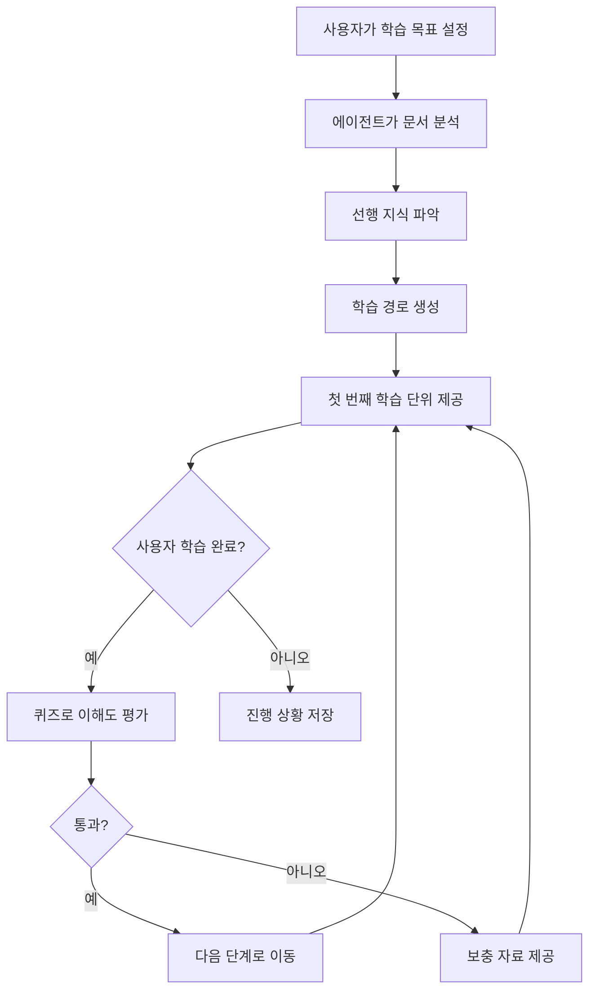

# iUM 에이전트 시스템 고도화 가이드

> 해커톤 심사 기준에 맞춘 개선 방향 제안

---

## 📋 심사 기준 요약

| 기준 | 설명 | 현재 상태 |
|------|------|-----------|
| **Functionality** | 핵심 기능의 안정성과 반응성 | ✅ 양호 |
| **Real-world Relevance** | 실제 사용자의 새해 목표에 적용 가능성 | 🟡 보완 필요 |
| **LLM/Agent 활용** | Reasoning chains, 자율성, 도구 사용 | 🟡 고도화 필요 |
| **Evaluation & Observability** | 시스템 동작 평가/모니터링 | 🟢 Opik 통합됨 |
| **Goal Alignment** | 학습/성장 지원, 보람있는 경험 제공 | 🟡 강화 필요 |

---

## 1. 🔧 Functionality 강화

### 1.1 현재 구현 상태
- ✅ RAG 기반 문서 분석 및 Q&A
- ✅ SSE 스트리밍으로 실시간 상태 업데이트
- ✅ 노트북 셀 자동 생성 (concept, quiz, math, code)
- ✅ 자동 동기화 (Supabase Storage)

### 1.2 개선 방향

#### A. 에러 핸들링 강화
```python
# 현재: 기본적인 에러 처리
# 제안: 사용자 친화적 에러 메시지 + 자동 재시도 로직

class RobustRAGChain:
    async def query_with_retry(self, question: str, max_retries: int = 3):
        for attempt in range(max_retries):
            try:
                async for event in self.query_rag_chain(question):
                    yield event
                return
            except Exception as e:
                if attempt < max_retries - 1:
                    yield {"status": "retry", "message": f"재시도 중... ({attempt + 1}/{max_retries})"}
                    await asyncio.sleep(1)
                else:
                    yield {"status": "error", "message": "잠시 후 다시 시도해주세요."}
```

#### B. 오프라인 지원
- IndexedDB를 활용한 로컬 캐싱
- 네트워크 복구 시 자동 동기화
- PWA 지원으로 모바일 설치 가능

---

## 2. 🌍 Real-world Relevance 강화

### 2.1 현재 한계
- 문서 업로드 → 학습 흐름만 지원
- 사용자의 **구체적인 학습 목표** 설정 기능 부재
- 학습 진행 상황 **추적/분석** 기능 미흡

### 2.2 개선 방향

#### A. 학습 목표 설정 시스템
```typescript
interface LearningGoal {
  id: string;
  title: string;                    // "3개월 내 Python 기초 마스터"
  targetDate: Date;
  category: 'skill' | 'knowledge' | 'habit';
  milestones: Milestone[];          // 중간 목표들
  attachedFolders: string[];        // 관련 학습 폴더
  progress: number;                 // 0-100%
  weeklyTarget: number;             // 주간 학습 시간 목표
}
```

#### B. 개인화된 학습 스케줄
```python
# 새로운 API 엔드포인트
@router.post("/api/goals/schedule")
async def generate_learning_schedule(goal: LearningGoal):
    """
    LLM을 활용해 사용자의 목표와 가용 시간을 분석하고
    최적의 학습 스케줄을 생성합니다.
    """
    prompt = f"""
    사용자의 학습 목표: {goal.title}
    목표 기한: {goal.targetDate}
    업로드된 학습 자료: {goal.attachedFolders}
    
    이 정보를 바탕으로 주간 학습 계획을 수립해주세요.
    각 주차별로 학습할 내용과 예상 시간을 포함해주세요.
    """
    # LLM으로 personalized schedule 생성
```

#### C. 학습 리마인더 & 알림
- 일일/주간 학습 리마인더
- 목표 달성률 기반 동기 부여 메시지
- 학습 스트릭 유지 알림

---

## 3. 🤖 LLM/Agent 활용 고도화

### 3.1 현재 구현
- ✅ Single-turn RAG 응답
- ✅ Opik 트레이싱
- ✅ 3-layer 메모리 아키텍처 (Working, Episodic, Semantic)

### 3.2 개선 방향

#### A. Multi-step Reasoning Chain (ReAct 패턴)

> [!IMPORTANT]
> 단순 Q&A를 넘어 **복잡한 학습 질문**에 대한 다단계 추론을 지원합니다.

```python
# apps/api/utils/react_agent.py (신규)

class ReActLearningAgent:
    """
    ReAct (Reasoning + Acting) 패턴을 적용한 학습 에이전트.
    
    예시 흐름:
    1. Thought: 사용자가 미적분 개념을 이해하려면 먼저 극한 개념이 필요해
    2. Action: search_documents("극한의 정의")
    3. Observation: 문서에서 극한 관련 내용 발견
    4. Thought: 이제 도함수 개념을 설명할 수 있어
    5. Action: generate_learning_unit(type="concept", topic="도함수")
    6. Final Answer: 체계적인 설명 + 연습 문제
    """
    
    SYSTEM_PROMPT = """
    당신은 iUM의 학습 에이전트입니다.
    사용자의 질문을 분석하고, 필요시 여러 단계로 나누어 해결합니다.
    
    사용 가능한 도구:
    - search_documents(query): 업로드된 문서에서 관련 내용 검색
    - generate_quiz(topic, difficulty): 퀴즈 생성
    - create_diagram(concept): 개념 다이어그램 생성
    - find_prerequisites(topic): 선행 지식 파악
    
    각 단계에서 Thought → Action → Observation 형식을 따르세요.
    """
    
    async def run(self, user_query: str, session_id: str):
        tools = [
            SearchDocumentsTool(self.vector_store),
            GenerateQuizTool(self.llm),
            CreateDiagramTool(self.llm),
            FindPrerequisitesTool(self.llm),
        ]
        
        max_iterations = 5
        for i in range(max_iterations):
            # 1. LLM에게 다음 행동 결정 요청
            thought_action = await self.llm.invoke(
                self.SYSTEM_PROMPT + f"\n현재 상태: {self.scratchpad}"
            )
            
            # 2. 액션 파싱 및 실행
            action = self.parse_action(thought_action)
            if action.name == "Final Answer":
                return action.input
            
            # 3. 도구 실행
            observation = await self.execute_tool(action, tools)
            
            # 4. 스크래치패드에 기록
            self.scratchpad += f"\nThought: {thought_action}\nObservation: {observation}"
        
        return self.summarize_scratchpad()
```

#### B. Tool Use 확장

```python
# 새로운 도구들 정의

class LearningTools:
    @tool
    def analyze_learning_gaps(self, user_id: str, topic: str) -> str:
        """사용자의 학습 이력을 분석하여 부족한 부분을 파악합니다."""
        # 퀴즈 결과, 북마크, 학습 시간 분석
        
    @tool
    def suggest_next_topic(self, current_topic: str, mastery_level: float) -> str:
        """현재 주제의 이해도를 바탕으로 다음 학습 주제를 추천합니다."""
        
    @tool
    def create_spaced_repetition_schedule(self, topic: str) -> Dict:
        """에빙하우스 망각곡선 기반 복습 스케줄을 생성합니다."""
        
    @tool
    def generate_analogies(self, concept: str, user_background: str) -> str:
        """사용자의 배경 지식에 맞는 비유를 생성합니다."""
```

#### C. Autonomous Learning Path 생성



---

## 4. 📊 Evaluation & Observability 강화

### 4.1 현재 구현
- ✅ Opik 기본 통합
- ✅ 평가 데이터셋 관리 API
- ✅ LLM-as-Judge 메트릭

### 4.2 개선 방향

#### A. 학습 효과 측정 메트릭

```python
# apps/api/utils/learning_metrics.py (신규)

class LearningEffectivenessMetrics:
    """학습 효과를 측정하는 커스텀 메트릭들"""
    
    async def knowledge_retention_score(
        self, user_id: str, topic: str, quiz_history: List[QuizResult]
    ) -> float:
        """
        시간에 따른 지식 retention 점수 계산.
        에빙하우스 망각곡선 모델 기반.
        """
        
    async def learning_velocity(
        self, user_id: str, time_window_days: int = 7
    ) -> Dict:
        """
        학습 속도 측정.
        - 주당 완료한 학습 단위 수
        - 평균 퀴즈 정답률 변화
        - 북마크 대비 복습 비율
        """
        
    async def engagement_score(self, session_id: str) -> float:
        """
        세션 참여도 점수.
        - 질문 깊이 (follow-up 질문 비율)
        - 셀 상호작용 (북마크, 메모)
        - 세션 지속 시간
        """
```

#### B. Human-in-the-Loop 검증

```typescript
// 프론트엔드: 피드백 수집 강화
interface DetailedFeedback {
  responseId: string;
  rating: 1 | 2 | 3 | 4 | 5;
  categories: {
    accuracy: boolean;      // 정보가 정확한가?
    clarity: boolean;       // 설명이 명확한가?
    relevance: boolean;     // 질문에 적절한가?
    depth: boolean;         // 충분히 깊이 있는가?
  };
  freeformFeedback?: string;
  suggestedImprovement?: string;
}

// 피드백 데이터로 시스템 개선
// → Opik 대시보드에서 트렌드 분석
// → 낮은 점수 패턴 파악 → 프롬프트 개선
```

#### C. A/B 테스트 프레임워크

```python
# apps/api/utils/ab_testing.py (신규)

class ABTestingFramework:
    """프롬프트 및 UI 개선을 위한 A/B 테스트"""
    
    async def create_experiment(
        self,
        name: str,
        variants: List[Dict],  # [{"name": "control", "weight": 0.5}, ...]
        metric: str,           # "quiz_pass_rate" | "engagement_score" | ...
    ):
        """새로운 A/B 테스트 실험 생성"""
        
    async def assign_variant(self, user_id: str, experiment_name: str) -> str:
        """사용자를 실험 그룹에 배정"""
        
    async def track_conversion(
        self, user_id: str, experiment_name: str, metric_value: float
    ):
        """전환/성과 지표 기록"""
        
    async def get_experiment_results(self, experiment_name: str) -> Dict:
        """통계적 유의성을 포함한 실험 결과 반환"""
```

---

## 5. 🎯 Goal Alignment 강화

### 5.1 현재 한계
- 학습 콘텐츠 생성은 잘 되지만, **동기 부여** 요소 부족
- 학습 **성취감**을 느끼기 어려운 UI
- 장기적인 **성장 추적** 기능 미흡

### 5.2 개선 방향

#### A. 게이미피케이션 시스템

```typescript
// apps/web/lib/gamification.ts (신규)

interface Achievement {
  id: string;
  name: string;
  description: string;
  icon: string;
  requirement: {
    type: 'streak' | 'quizzes_passed' | 'cells_created' | 'time_spent';
    threshold: number;
  };
  xpReward: number;
  unlockedAt?: Date;
}

interface UserProgress {
  level: number;
  currentXP: number;
  nextLevelXP: number;
  streak: number;
  achievements: Achievement[];
  weeklyGoal: {
    target: number;      // 목표 학습 시간 (분)
    current: number;     // 현재 학습 시간
  };
}

// 예시 업적들
const ACHIEVEMENTS: Achievement[] = [
  {
    id: 'first_quiz',
    name: '첫 걸음',
    description: '첫 번째 퀴즈를 완료했습니다!',
    icon: '🎉',
    requirement: { type: 'quizzes_passed', threshold: 1 },
    xpReward: 50,
  },
  {
    id: 'week_streak',
    name: '7일 연속 학습',
    description: '일주일 동안 매일 학습했습니다!',
    icon: '🔥',
    requirement: { type: 'streak', threshold: 7 },
    xpReward: 200,
  },
  // ...
];
```

#### B. 성찰 저널 (Reflection Journal)

> [!TIP]
> 자기 인식과 메타인지를 통한 효과적인 학습 지원

```python
# apps/api/routers/reflection.py (신규)

@router.post("/api/reflection/prompt")
async def generate_reflection_prompt(context: ReflectionContext):
    """
    오늘의 학습 내용을 바탕으로 성찰 질문을 생성합니다.
    
    예시 질문:
    - "오늘 배운 [미적분] 개념 중 가장 어려웠던 부분은 무엇인가요?"
    - "이 개념을 일상생활에서 어떻게 활용할 수 있을까요?"
    - "내일 복습할 때 특히 집중하고 싶은 부분이 있나요?"
    """

@router.post("/api/reflection/analyze")
async def analyze_reflection(entry: ReflectionEntry):
    """
    사용자의 성찰 기록을 분석하여 인사이트를 제공합니다.
    
    - 학습 패턴 분석
    - 감정 상태 트래킹
    - 성장 포인트 식별
    """
```

#### C. 시각적 성장 추적

```typescript
// 학습 성장 대시보드 컴포넌트

interface GrowthDashboard {
  // 주간 학습 히트맵 (GitHub 스타일)
  weeklyHeatmap: {
    date: string;
    intensity: 0 | 1 | 2 | 3 | 4;  // 학습 강도
  }[];
  
  // 스킬 레이더 차트
  skillRadar: {
    skill: string;
    level: number;      // 0-100
    change: number;     // 지난 주 대비 변화
  }[];
  
  // 학습 타임라인
  milestones: {
    date: Date;
    title: string;
    type: 'achievement' | 'goal_complete' | 'streak';
  }[];
}
```

---

## 6. 🚀 구현 우선순위 로드맵

### Phase 1: 핵심 개선 (데모용 - 1-2일)
| 우선순위 | 항목 | 예상 시간 |
|---------|------|----------|
| 🔴 | ReAct 에이전트 기본 구현 | 4시간 |
| 🔴 | 학습 목표 설정 UI/API | 3시간 |
| 🔴 | 게이미피케이션 (XP, 레벨, 스트릭) | 3시간 |

### Phase 2: 가시적 개선 (1주일)
| 우선순위 | 항목 | 예상 시간 |
|---------|------|----------|
| 🟡 | 학습 효과 메트릭 대시보드 | 4시간 |
| 🟡 | 성찰 저널 기능 | 3시간 |
| 🟡 | A/B 테스트 프레임워크 | 4시간 |

### Phase 3: 고도화 (2주일+)
| 우선순위 | 항목 | 예상 시간 |
|---------|------|----------|
| 🟢 | 완전한 Multi-step Agent | 8시간 |
| 🟢 | 간격 반복 학습 시스템 | 6시간 |
| 🟢 | 개인화 학습 경로 추천 | 8시간 |

---

## 7. 📝 빠른 적용 체크리스트

데모 전 빠르게 적용할 수 있는 개선 사항:

- [ ] **README 업데이트**: 심사 기준에 맞춘 기능 하이라이팅
- [ ] **LLM 프롬프트 개선**: Reasoning chain 명시적으로 출력하도록 수정
- [ ] **Opik 대시보드 스크린샷**: 평가 결과 시각화 자료 준비
- [ ] **데모 시나리오 작성**: 
  1. 학습 목표 설정 → 문서 업로드 → AI 튜터링
  2. 퀴즈 생성 → 오답 분석 → 복습 권장
  3. 학습 진행률 확인 → 성취 달성

---

## 부록: 참고 자료

### A. ReAct 패턴 참고
- [ReAct: Synergizing Reasoning and Acting in Language Models](https://arxiv.org/abs/2210.03629)
- [LangChain ReAct Agent](https://python.langchain.com/docs/modules/agents/agent_types/react)

### B. 학습 과학 원리
- 간격 반복 (Spaced Repetition)
- 테스트 효과 (Testing Effect)
- 정교화 심문 (Elaborative Interrogation)

### C. Opik 통합 강화
- [Opik Evaluation Docs](https://www.comet.com/docs/opik/evaluation/)
- [Custom Metrics 정의](https://www.comet.com/docs/opik/evaluation/metrics/)

---

*마지막 업데이트: 2026-02-08*
