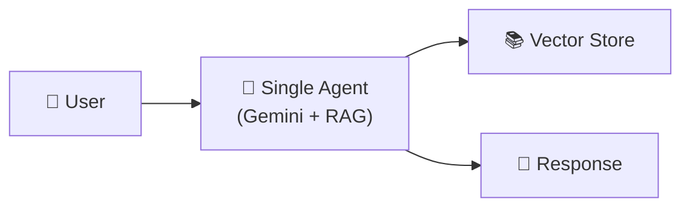
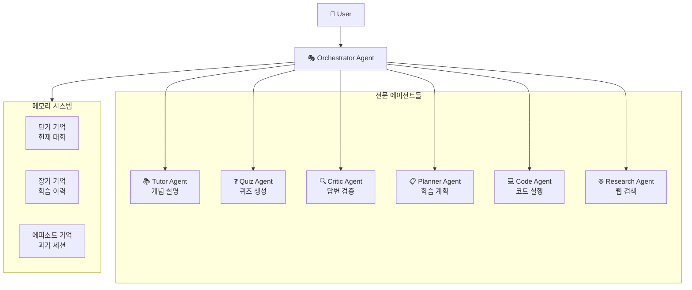
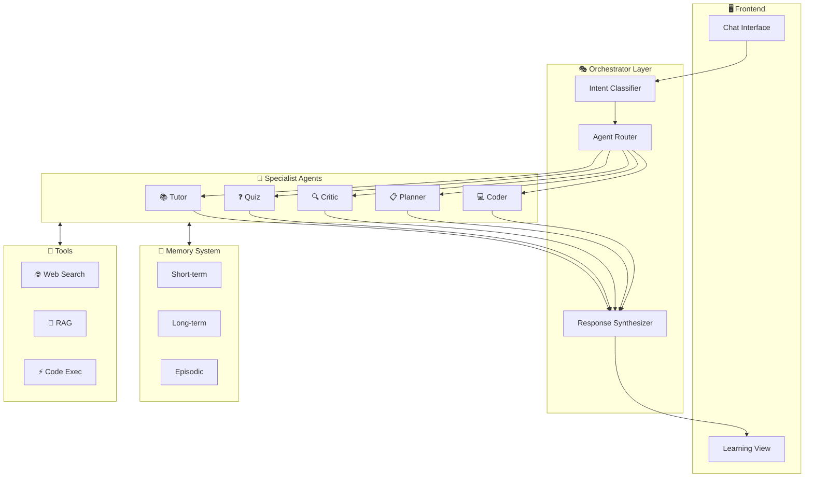

# iUM 멀티에이전트 시스템 발전 방안

> 현재 단일 RAG 에이전트를 **완성도 높은 멀티에이전트 시스템**으로 발전시키는 로드맵

---

## 📊 현재 시스템 분석

### 현재 아키텍처


### 현재 한계점
| 문제 | 설명 |
|------|------|
| **단일 역할** | 하나의 프롬프트가 모든 작업 수행 (설명, 퀴즈, 요약 등) |
| **컨텍스트 부족** | 대화 기록이 지속되지 않음 (`conversation_id`가 mock) |
| **도구 없음** | 웹 검색, 코드 실행, 파일 조작 등 외부 도구 미지원 |
| **자기 검증 없음** | 생성된 답변의 정확성 검증 단계 부재 |
| **계획 능력 부족** | 복잡한 학습 목표를 단계별로 분해하지 못함 |

---

## 🎯 목표: 멀티에이전트 학습 시스템

### 제안 아키텍처


---

## 🔧 Phase 1: 기반 개선 (2-3일)

### 1.1 대화 메모리 시스템 구축

**현재 문제:**
```python
# agent.py - conversation_id가 하드코딩됨
conversation_id=request.conversation_id or "conv-1"
```

**개선안: Redis/Supabase 기반 메모리**
```python
# utils/memory.py (신규)
from langchain.memory import ConversationBufferWindowMemory
from langchain_community.chat_message_histories import RedisChatMessageHistory

class ConversationMemory:
    def __init__(self, session_id: str, user_id: str):
        self.history = RedisChatMessageHistory(
            session_id=session_id,
            url=os.getenv("REDIS_URL")
        )
        self.memory = ConversationBufferWindowMemory(
            chat_memory=self.history,
            k=10,  # 최근 10개 대화만 유지
            return_messages=True
        )
    
    def add_message(self, role: str, content: str):
        if role == "user":
            self.history.add_user_message(content)
        else:
            self.history.add_ai_message(content)
    
    def get_context(self) -> str:
        return self.memory.load_memory_variables({})["history"]
```

### 1.2 도구 시스템 추가 (Tool Use)

**LangChain Tools 통합:**
```python
# utils/tools.py (신규)
from langchain.tools import Tool, StructuredTool
from langchain_community.tools import DuckDuckGoSearchRun
from langchain_experimental.tools import PythonREPLTool

# 웹 검색 도구
web_search = DuckDuckGoSearchRun()

# Python 코드 실행 도구
python_repl = PythonREPLTool()

# 커스텀 도구: 문서 검색
def search_documents(query: str, folder_id: str) -> str:
    """Search user's uploaded documents"""
    retriever = get_retriever(folder_id=folder_id, k=3)
    docs = retriever.invoke(query)
    return "\n\n".join([d.page_content for d in docs])

document_search = Tool(
    name="search_documents",
    description="Search the user's uploaded learning materials",
    func=search_documents
)

AVAILABLE_TOOLS = [web_search, python_repl, document_search]
```

### 1.3 ReAct 패턴 도입

**현재:** 단순 프롬프트 → 응답  
**개선:** Reasoning + Acting 루프

```python
# utils/react_agent.py (신규)
from langchain.agents import AgentExecutor, create_react_agent
from langchain_core.prompts import PromptTemplate

REACT_PROMPT = """You are iUM, an AI learning tutor.

You have access to the following tools:
{tools}

Use this format:
Thought: Consider what to do
Action: tool name
Action Input: input for the tool
Observation: result from the tool
... (repeat N times)
Thought: I now know the answer
Final Answer: your response to the user

Question: {input}
{agent_scratchpad}"""

def create_ium_agent(llm, tools):
    prompt = PromptTemplate.from_template(REACT_PROMPT)
    agent = create_react_agent(llm, tools, prompt)
    return AgentExecutor(
        agent=agent,
        tools=tools,
        verbose=True,
        max_iterations=5,
        handle_parsing_errors=True
    )
```

---

## 🚀 Phase 2: 멀티에이전트 구조 (1주)

### 2.1 전문 에이전트 정의

```python
# agents/specialist_agents.py (신규)
from abc import ABC, abstractmethod
from pydantic import BaseModel

class AgentResponse(BaseModel):
    content: str
    confidence: float
    metadata: dict = {}

class SpecialistAgent(ABC):
    def __init__(self, llm, name: str):
        self.llm = llm
        self.name = name
    
    @abstractmethod
    async def process(self, query: str, context: dict) -> AgentResponse:
        pass


class TutorAgent(SpecialistAgent):
    """개념 설명 전문 에이전트"""
    
    SYSTEM_PROMPT = """You are a Feynman-style tutor.
    Explain concepts simply with analogies and diagrams.
    Always include a Mermaid diagram in your explanation."""
    
    async def process(self, query: str, context: dict) -> AgentResponse:
        # RAG 검색 수행
        docs = context.get("retrieved_docs", [])
        messages = [
            {"role": "system", "content": self.SYSTEM_PROMPT},
            {"role": "user", "content": f"Context: {docs}\n\nQuestion: {query}"}
        ]
        response = await self.llm.ainvoke(messages)
        return AgentResponse(content=response.content, confidence=0.9)


class QuizAgent(SpecialistAgent):
    """퀴즈 생성 전문 에이전트"""
    
    SYSTEM_PROMPT = """You are a quiz master.
    Generate challenging but fair questions.
    Include explanations for each answer."""
    
    async def process(self, query: str, context: dict) -> AgentResponse:
        # 퀴즈 특화 로직
        ...


class CriticAgent(SpecialistAgent):
    """답변 검증 전문 에이전트"""
    
    SYSTEM_PROMPT = """You are a fact-checker.
    Verify the accuracy of the given response.
    Point out any errors or misconceptions."""
    
    async def process(self, answer: str, context: dict) -> AgentResponse:
        messages = [
            {"role": "system", "content": self.SYSTEM_PROMPT},
            {"role": "user", "content": f"Verify this answer:\n{answer}\n\nOriginal sources:\n{context.get('sources', '')}"}
        ]
        response = await self.llm.ainvoke(messages)
        return AgentResponse(
            content=response.content,
            confidence=self._extract_confidence(response.content),
            metadata={"verified": True}
        )


class PlannerAgent(SpecialistAgent):
    """학습 계획 전문 에이전트"""
    
    async def process(self, goal: str, context: dict) -> AgentResponse:
        # 학습 목표를 단계별 계획으로 분해
        ...


class CoderAgent(SpecialistAgent):
    """코드 실행 전문 에이전트"""
    
    async def process(self, code_request: str, context: dict) -> AgentResponse:
        # 코드 생성 및 샌드박스 실행
        ...
```

### 2.2 오케스트레이터 에이전트

```python
# agents/orchestrator.py (신규)
from enum import Enum
from typing import List

class TaskType(Enum):
    EXPLAIN = "explain"
    QUIZ = "quiz"
    CODE = "code"
    RESEARCH = "research"
    PLAN = "plan"
    VERIFY = "verify"

class OrchestratorAgent:
    """에이전트들을 조율하는 메타 에이전트"""
    
    def __init__(self, llm):
        self.llm = llm
        self.agents = {
            TaskType.EXPLAIN: TutorAgent(llm, "Tutor"),
            TaskType.QUIZ: QuizAgent(llm, "Quiz"),
            TaskType.CODE: CoderAgent(llm, "Coder"),
            TaskType.VERIFY: CriticAgent(llm, "Critic"),
            TaskType.PLAN: PlannerAgent(llm, "Planner"),
        }
    
    async def classify_intent(self, query: str) -> List[TaskType]:
        """사용자 의도를 분류하여 필요한 에이전트 결정"""
        classification_prompt = f"""Classify the user's intent:
        Query: {query}
        
        Choose from: explain, quiz, code, research, plan
        Return as JSON: {{"tasks": ["task1", "task2"]}}"""
        
        response = await self.llm.ainvoke(classification_prompt)
        tasks = self._parse_tasks(response.content)
        return tasks
    
    async def execute(self, query: str, context: dict) -> dict:
        """멀티에이전트 실행 파이프라인"""
        
        # 1. 의도 분류
        tasks = await self.classify_intent(query)
        
        # 2. 관련 에이전트 병렬 실행
        results = {}
        for task in tasks:
            agent = self.agents.get(task)
            if agent:
                results[task.value] = await agent.process(query, context)
        
        # 3. Critic 에이전트로 검증 (선택적)
        if TaskType.EXPLAIN in tasks:
            main_answer = results.get(TaskType.EXPLAIN.value)
            if main_answer:
                verification = await self.agents[TaskType.VERIFY].process(
                    main_answer.content, context
                )
                results["verification"] = verification
        
        # 4. 결과 종합
        return self._synthesize_results(results)
```

### 2.3 에이전트 통신 프로토콜

```python
# agents/protocol.py (신규)
from pydantic import BaseModel
from typing import Optional, List
from datetime import datetime

class AgentMessage(BaseModel):
    """에이전트 간 통신 메시지"""
    sender: str
    receiver: str
    content: str
    message_type: str  # "request", "response", "delegation"
    timestamp: datetime = datetime.now()
    correlation_id: str  # 요청-응답 매칭용
    metadata: dict = {}

class AgentBus:
    """에이전트 간 메시지 버스"""
    
    def __init__(self):
        self.subscribers = {}
        self.message_log = []
    
    def subscribe(self, agent_name: str, handler):
        self.subscribers[agent_name] = handler
    
    async def publish(self, message: AgentMessage):
        self.message_log.append(message)
        if message.receiver in self.subscribers:
            await self.subscribers[message.receiver](message)
```

---

## 🧠 Phase 3: 고급 기능 (2주)

### 3.1 Self-Reflection (자기 성찰)

```python
# agents/reflection.py (신규)
class ReflectionLoop:
    """답변 품질 자가 개선 루프"""
    
    MAX_ITERATIONS = 3
    QUALITY_THRESHOLD = 0.8
    
    async def reflect_and_improve(
        self, 
        initial_response: str, 
        query: str,
        critic: CriticAgent
    ) -> str:
        current_response = initial_response
        
        for i in range(self.MAX_ITERATIONS):
            # Critic이 평가
            evaluation = await critic.process(current_response, {"query": query})
            
            if evaluation.confidence >= self.QUALITY_THRESHOLD:
                break
            
            # 피드백 기반 개선
            improvement_prompt = f"""
            Original response: {current_response}
            Criticism: {evaluation.content}
            
            Please improve the response based on the feedback.
            """
            current_response = await self._improve(improvement_prompt)
        
        return current_response
```

### 3.2 학습 경로 계획 (Curriculum Planning)

```python
# agents/curriculum.py (신규)
class CurriculumPlanner:
    """개인화된 학습 경로 생성"""
    
    async def create_learning_path(
        self, 
        goal: str, 
        user_level: str,
        available_materials: List[str]
    ) -> dict:
        planning_prompt = f"""
        Learning Goal: {goal}
        User Level: {user_level}
        Available Materials: {available_materials}
        
        Create a structured learning path with:
        1. Prerequisites to review
        2. Core concepts to learn (ordered)
        3. Practice exercises
        4. Assessment checkpoints
        
        Return as JSON with milestones and estimated time.
        """
        
        response = await self.llm.ainvoke(planning_prompt)
        return self._parse_curriculum(response.content)
```

### 3.3 적응형 난이도 조절

```python
# agents/adaptive.py (신규)
class AdaptiveDifficultyAgent:
    """사용자 수준에 맞춘 난이도 조절"""
    
    def __init__(self):
        self.user_performance = {}  # user_id -> performance metrics
    
    def track_performance(self, user_id: str, quiz_result: dict):
        if user_id not in self.user_performance:
            self.user_performance[user_id] = {
                "correct_rate": [],
                "topics": {},
                "difficulty_level": "medium"
            }
        
        self.user_performance[user_id]["correct_rate"].append(
            quiz_result["correct"] / quiz_result["total"]
        )
        self._adjust_difficulty(user_id)
    
    def _adjust_difficulty(self, user_id: str):
        recent_rate = sum(self.user_performance[user_id]["correct_rate"][-5:]) / 5
        
        if recent_rate > 0.8:
            self.user_performance[user_id]["difficulty_level"] = "hard"
        elif recent_rate < 0.5:
            self.user_performance[user_id]["difficulty_level"] = "easy"
        else:
            self.user_performance[user_id]["difficulty_level"] = "medium"
```

---

## 🔄 Phase 4: 프레임워크 통합 옵션

### 옵션 1: LangGraph (추천)

```python
# agents/langgraph_workflow.py
from langgraph.graph import StateGraph, END
from typing import TypedDict, Annotated

class AgentState(TypedDict):
    query: str
    context: dict
    tutor_response: str
    critic_feedback: str
    final_response: str
    iteration: int

def create_learning_workflow():
    workflow = StateGraph(AgentState)
    
    # 노드 정의
    workflow.add_node("retrieve", retrieve_documents)
    workflow.add_node("tutor", tutor_agent_node)
    workflow.add_node("critic", critic_agent_node)
    workflow.add_node("refine", refine_response_node)
    workflow.add_node("output", format_output_node)
    
    # 엣지 정의
    workflow.set_entry_point("retrieve")
    workflow.add_edge("retrieve", "tutor")
    workflow.add_edge("tutor", "critic")
    
    # 조건부 엣지: Critic 피드백에 따라 분기
    workflow.add_conditional_edges(
        "critic",
        should_refine,  # 함수: critic feedback 기반 판단
        {
            "refine": "refine",
            "output": "output"
        }
    )
    workflow.add_edge("refine", "tutor")  # 루프백
    workflow.add_edge("output", END)
    
    return workflow.compile()
```

### 옵션 2: CrewAI

```python
# agents/crew_config.py
from crewai import Agent, Task, Crew, Process

tutor_agent = Agent(
    role="Expert Tutor",
    goal="Explain concepts clearly using Feynman technique",
    backstory="You're a world-class educator...",
    llm=llm
)

critic_agent = Agent(
    role="Fact Checker",
    goal="Verify accuracy of explanations",
    backstory="You're a meticulous reviewer...",
    llm=llm
)

explain_task = Task(
    description="Explain {topic} to the student",
    agent=tutor_agent,
    expected_output="Clear explanation with diagrams"
)

verify_task = Task(
    description="Verify the explanation accuracy",
    agent=critic_agent,
    context=[explain_task]
)

crew = Crew(
    agents=[tutor_agent, critic_agent],
    tasks=[explain_task, verify_task],
    process=Process.sequential
)
```

### 옵션 3: AutoGen (Microsoft)

```python
# agents/autogen_config.py
from autogen import AssistantAgent, UserProxyAgent, GroupChat

tutor = AssistantAgent(
    name="Tutor",
    system_message="You are a Feynman-style tutor...",
    llm_config=llm_config
)

critic = AssistantAgent(
    name="Critic", 
    system_message="You verify explanations...",
    llm_config=llm_config
)

user_proxy = UserProxyAgent(
    name="Student",
    human_input_mode="NEVER",
    code_execution_config={"work_dir": "workspace"}
)

group_chat = GroupChat(
    agents=[user_proxy, tutor, critic],
    messages=[],
    max_round=10
)
```

---

## 📁 제안 프로젝트 구조

```
apps/api/
├── agents/                    # 🆕 멀티에이전트 시스템
│   ├── __init__.py
│   ├── base.py               # SpecialistAgent 베이스 클래스
│   ├── tutor.py              # 설명 에이전트
│   ├── quiz.py               # 퀴즈 에이전트
│   ├── critic.py             # 검증 에이전트
│   ├── planner.py            # 계획 에이전트
│   ├── coder.py              # 코드 실행 에이전트
│   ├── orchestrator.py       # 오케스트레이터
│   └── workflows/            # LangGraph 워크플로우
│       ├── learning_flow.py
│       └── quiz_flow.py
│
├── memory/                    # 🆕 메모리 시스템
│   ├── __init__.py
│   ├── conversation.py       # 대화 메모리
│   ├── episodic.py          # 에피소드 메모리
│   └── long_term.py         # 장기 메모리 (학습 이력)
│
├── tools/                     # 🆕 도구 시스템
│   ├── __init__.py
│   ├── web_search.py
│   ├── code_executor.py
│   └── document_search.py
│
├── routers/
│   ├── agent.py              # 기존 (리팩토링)
│   └── multi_agent.py        # 🆕 멀티에이전트 엔드포인트
│
└── utils/
    ├── rag_chain.py          # 기존
    └── react_agent.py        # 🆕 ReAct 패턴
```

---

## ⏱️ 구현 로드맵

| Phase | 기간 | 핵심 작업 |
|-------|------|----------|
| **Phase 1** | 2-3일 | 메모리 시스템, Tool Use, ReAct 패턴 |
| **Phase 2** | 1주 | 전문 에이전트 4개, 오케스트레이터 |
| **Phase 3** | 2주 | Self-Reflection, Curriculum Planning |
| **Phase 4** | 1주 | LangGraph 워크플로우 통합 |

---

## 🎯 최종 목표 아키텍처



---

## 📚 참고 자료

- [LangGraph Documentation](https://langchain-ai.github.io/langgraph/)
- [CrewAI Framework](https://github.com/joaomdmoura/crewAI)
- [AutoGen Multi-Agent](https://microsoft.github.io/autogen/)
- [ReAct: Reasoning and Acting](https://react-lm.github.io/)
- [Reflexion: Self-Reflection in LLMs](https://arxiv.org/abs/2303.11366)
