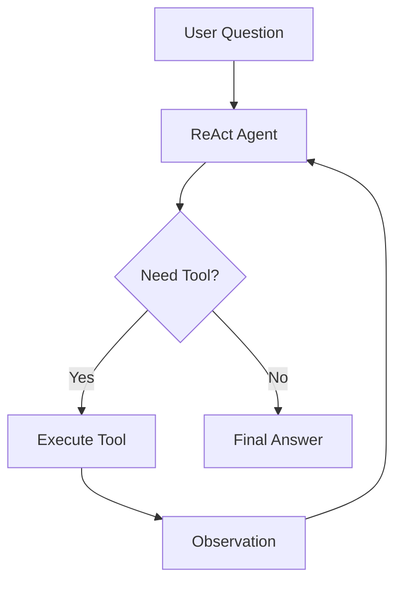

# ReAct Agent Implementation Walkthrough

## Overview

This document describes the implementation of the ReAct (Reasoning + Acting) pattern agent for the iUM learning platform.

## New Files Created

### 1. `apps/api/utils/learning_tools.py`
iUM-specific learning tools (6 tools):
| Tool | Function |
|------|----------|
| `search_knowledge` | Search documents (RAG) |
| `generate_concept_cell` | Generate concept explanation cell |
| `create_quiz_cell` | Generate quiz cell |
| `check_prerequisites` | Analyze prerequisite knowledge |
| `get_learning_history` | Retrieve learning history |
| `suggest_next_topic` | Recommend next topics |

### 2. `apps/api/utils/react_agent.py`
ReAct pattern agent core logic:
- `Thought` → `Action` → `Observation` loop
- Maximum 5 iterations before Final Answer
- Opik tracing integration

## Modified Files

### `apps/api/routers/agent.py`
- Added `use_react` parameter (default: `true`)
- Supports both ReAct and legacy RAG modes

---

## API Usage

### Request
```json
POST /api/agent/message
{
  "message": "What is machine learning?",
  "use_react": true
}
```

### Response (Streaming)
```json
→ {"status": "progress", "step": "thinking", "message": "Analyzing..."}
→ {"status": "progress", "step": "action_1", "message": "Executing tool..."}
→ {"status": "complete", "data": {...}}
```

---

## Architecture



---

*Last updated: 2026-02-08*
