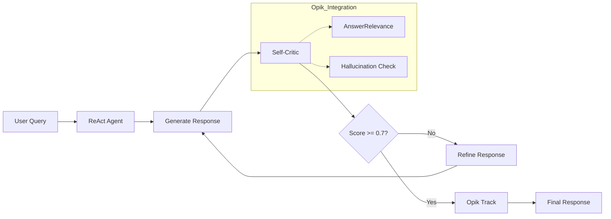

# Self-Reflection Loop 구현 계획

> ReAct 에이전트에 자가 품질 검증 기능을 추가하여 응답 품질 향상

---

## 목표

1. **Self-Reflection Loop**: 에이전트가 응답을 생성한 후 Critic 단계를 거쳐 품질 검증
2. **Opik 통합**: 평가 메트릭(AnswerRelevance, Hallucination)을 실시간으로 활용
3. **자동 개선**: 품질이 낮으면 자동으로 응답을 개선하고 재생성

---

## 아키텍처



---

## Proposed Changes

### Core Component: Self-Reflection Module

#### [NEW] [self_reflection.py](file:///c:/sihyun/kaist/encode_hackathon_2/iUM/apps/api/utils/self_reflection.py)

새로운 Self-Reflection 모듈 생성:

```python
class SelfReflectionLoop:
    MAX_ITERATIONS = 2
    QUALITY_THRESHOLD = 0.7
    
    def __init__(self, llm):
        self.llm = llm
        self.opik_enabled = os.getenv("OPIK_API_KEY") is not None
    
    async def evaluate_and_improve(
        self,
        response: str,
        query: str,
        context: Optional[str] = None
    ) -> Tuple[str, Dict[str, Any]]:
        """
        Evaluate response quality and improve if needed.
        
        Returns:
            Tuple of (final_response, evaluation_metrics)
        """
```

**핵심 기능**:
1. **LLM-as-Judge**: Gemini를 사용한 자가 평가 (OPIK_API_KEY 없어도 작동)
2. **Opik 메트릭 (선택적)**: `AnswerRelevance`, `Hallucination` 메트릭 활용
3. **Refinement Loop**: 품질 미달 시 최대 2회 재생성

---

#### [MODIFY] [react_agent.py](file:///c:/sihyun/kaist/encode_hackathon_2/iUM/apps/api/utils/react_agent.py)

기존 ReAct 에이전트에 Self-Reflection 통합:

**변경 1**: Self-Reflection 임포트 및 초기화 (Line ~78)
```python
from utils.self_reflection import SelfReflectionLoop

class ReactLearningAgent:
    def __init__(self, ...):
        ...
        self.reflection = SelfReflectionLoop(self.llm)
```

**변경 2**: Final Answer 생성 직전 Self-Reflection 적용 (Line ~241)
```python
if final_answer:
    # Self-Reflection Loop 적용
    final_answer, eval_metrics = await self.reflection.evaluate_and_improve(
        response=final_answer,
        query=question,
        context=self.initial_document_context
    )
    
    # Opik 트래킹에 평가 메트릭 추가
    self.evaluation_metrics = eval_metrics
```

**변경 3**: 결과에 평가 메트릭 포함 (Line ~248-258)
```python
yield {
    "status": "complete",
    "data": {
        ...
        "evaluation_metrics": getattr(self, 'evaluation_metrics', {})
    }
}
```

---

#### [MODIFY] [opik_config.py](file:///c:/sihyun/kaist/encode_hackathon_2/iUM/apps/api/utils/opik_config.py)

실시간 평가를 위한 헬퍼 함수 추가:

**추가**: 단일 응답 평가 함수 (Line ~175 이후)
```python
async def evaluate_single_response(
    question: str,
    answer: str,
    context: Optional[List[str]] = None
) -> Dict[str, float]:
    """
    Evaluate a single response using Opik metrics.
    Returns dict with metric scores.
    """
```

---

## Verification Plan

### 자동화 테스트

#### 1. 유닛 테스트: Self-Reflection 모듈
```bash
# tests/test_self_reflection.py 생성 후 실행
cd c:\sihyun\kaist\encode_hackathon_2\iUM\apps\api
python -m pytest tests/test_self_reflection.py -v
```

테스트 케이스:
- `test_evaluate_good_response`: 품질 좋은 응답 → 개선 없이 통과
- `test_evaluate_poor_response`: 품질 낮은 응답 → 개선 후 반환
- `test_max_iterations_reached`: 최대 반복 후 중단

#### 2. 통합 테스트: API 호출
```bash
# API 서버 실행 상태에서
curl -X POST http://localhost:8000/api/agent/message \
  -H "Content-Type: application/json" \
  -d '{"message": "양자역학이 뭐야?", "use_react": true}'
```

응답에 `evaluation_metrics` 필드가 포함되어야 함.

---

### 수동 테스트

#### 1. Self-Reflection 작동 확인
1. API 서버 재시작: `uvicorn main:app --reload`
2. 웹 UI에서 채팅 테스트
3. 복잡한 질문 (예: "양자역학의 불확정성 원리를 설명해줘") 입력
4. API 로그에서 `[SelfReflection]` 메시지 확인
5. 응답에 `evaluation_metrics` 포함 확인

#### 2. Opik 대시보드 확인 (OPIK_API_KEY 설정 시)
1. https://www.comet.com/opik 접속
2. iUM 프로젝트 선택
3. 트레이스에 `self_reflection_loop` 스팬 확인
4. 평가 메트릭 점수 확인

---

## 구현 순서

| 순서 | 작업 | 예상 시간 |
|------|------|----------|
| 1 | `self_reflection.py` 생성 | 30분 |
| 2 | `react_agent.py` 수정 | 20분 |
| 3 | `opik_config.py` 헬퍼 함수 추가 | 15분 |
| 4 | 테스트 파일 생성 및 실행 | 20분 |
| 5 | 통합 테스트 (API) | 15분 |

**총 예상 시간**: 1.5 ~ 2시간

---

## User Review Required

> [!IMPORTANT]
> **선택 사항**: Opik API가 없어도 작동하도록 **Fallback LLM-as-Judge**를 구현할 예정입니다.
> Opik API가 있으면 더 정교한 메트릭(AnswerRelevance, Hallucination)을 사용하고,
> 없으면 Gemini를 사용한 간단한 자가 평가를 수행합니다.

질문:
1. **반복 횟수**: 품질 개선 시도를 최대 몇 번까지 허용할까요? (기본값: 2회)
2. **품질 임계값**: 어느 점수 이상이면 통과로 볼까요? (기본값: 0.7)
3. **UI 표시**: 평가 메트릭을 프론트엔드에 표시할까요? (예: "신뢰도: 85%")
