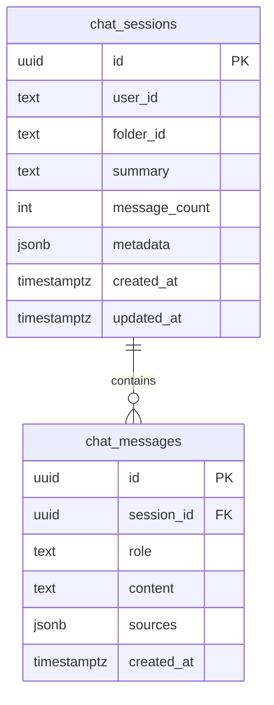

# Phase 2: Supabase Memory Storage - Walkthrough

> **상태**: ✅ 구현 완료  
> **날짜**: 2026-02-02  
> **관련 Plan**: [2026-02-02_phase2_memory_plan.md](./2026-02-02_phase2_memory_plan.md)

---

## 구현 완료 요약

Phase 2 메모리 시스템이 성공적으로 구현되었습니다. 이제 대화 이력이 Supabase에 영구 저장되어 브라우저 새로고침 후에도 이전 대화를 불러올 수 있습니다.

---

## 변경된 파일

### 신규 파일

| 파일 | 설명 |
|------|------|
| `apps/api/migrations/003_create_chat_history_tables.sql` | 대화 세션 및 메시지 테이블 스키마 |
| `apps/api/routers/memory.py` | 세션 관리 API 라우터 |

### 수정된 파일

| 파일 | 변경 사항 |
|------|-----------|
| `apps/api/utils/memory_manager.py` | `EpisodicMemory` 클래스 추가, 비동기 저장/로드 메서드 |
| `apps/api/routers/agent.py` | `user_id` 필드 추가, 비동기 메모리 persistence |
| `apps/api/main.py` | memory 라우터 등록 |

---

## 데이터베이스 스키마



---

## 새로운 API 엔드포인트

### Memory Router (`/api/memory`)

| Method | Endpoint | 설명 |
|--------|----------|------|
| `GET` | `/sessions` | 사용자의 모든 세션 목록 |
| `GET` | `/sessions/{id}` | 특정 세션 상세 정보 |
| `GET` | `/sessions/{id}/messages` | 세션의 모든 메시지 |
| `DELETE` | `/sessions/{id}` | 세션 삭제 |
| `POST` | `/sessions/{id}/clear` | 세션 메시지 초기화 |
| `GET` | `/health` | 메모리 시스템 상태 확인 |

---

## 다음 단계: Migration 실행

Supabase Dashboard에서 SQL Editor를 열고 다음 마이그레이션을 실행해주세요:

```sql
-- 파일: iUM/apps/api/migrations/003_create_chat_history_tables.sql
-- 전체 내용을 복사하여 실행
```

---

## 테스트 방법

### 1. 서버 실행
```bash
conda activate encode
cd iUM/apps/api
uvicorn main:app --reload --port 8000
```

### 2. API 테스트

```bash
# 메모리 시스템 상태 확인
curl http://localhost:8000/api/memory/health

# 세션 목록 조회
curl "http://localhost:8000/api/memory/sessions?user_id=test-user"
```

### 3. 대화 테스트

1. 프론트엔드에서 대화 진행
2. 브라우저 새로고침
3. 동일 폴더에서 이전 대화 컨텍스트가 유지되는지 확인

---

## 아키텍처 변경 요약

```
Before (Phase 1):
┌─────────────────┐
│  Working Memory │  ← In-memory only (휘발성)
│   (k=10 msgs)   │
└─────────────────┘

After (Phase 2):
┌─────────────────┐
│  Working Memory │  ← Fast access cache
│   (k=10 msgs)   │
└────────┬────────┘
         │ sync
         ▼
┌─────────────────┐
│ Episodic Memory │  ← Supabase persistent storage
│  (Supabase DB)  │
└─────────────────┘
```

---

## 구문 검사 결과

- ✅ `memory_manager.py` - 정상
- ✅ `memory.py` - 정상  
- ✅ `agent.py` - 정상
